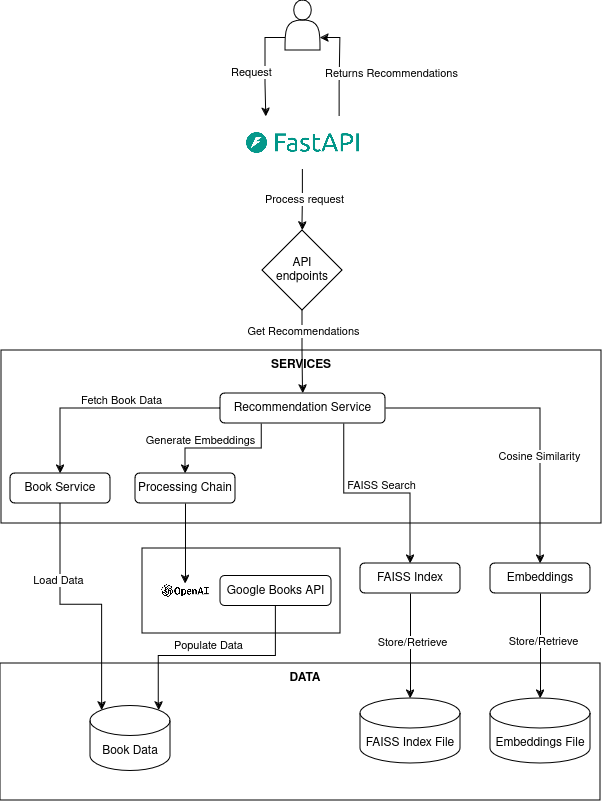

# Book Recommendation System

This project implements a book recommendation system based on book descriptions using OpenAI API for processing and Langchain for managing the processing pipeline.

## Features

- Collects book data from Google Books API
- Prepares and cleans data using Pandas and NLTK
- Obtains embeddings using OpenAI API
- Creates a processing chain using Langchain
- Recommends books based on similarity of embeddings
- Provides two recommendation methods: FAISS and Cosine Similarity

## Architecture

The architecture of the book recommendation system is outlined in the `architecture.md` file. Below is an overview of the system components and their interactions.



## Processing Flow

The processing flow of the Book Recommendation System involves several key steps to provide accurate book recommendations based on user queries. Here's a detailed overview:

1. **Data Collection and Preparation**:
   - Book data is collected from the Google Books API.
   - The data is then cleaned and prepared using Pandas and NLTK for further processing.

2. **Embedding Generation**:
   - Book descriptions are processed through the OpenAI API to generate embeddings.

3. **Processing Chain**:
   - The `ProcessingChain` class manages the flow of data through the system.
   - It creates embeddings for book descriptions and processes user queries to understand the context and intent.

4. **Recommendation Generation**:
   - Based on the processed query, the system uses either FAISS or Cosine Similarity to find the most similar book descriptions.
   - Recommendations are then generated based on the similarity scores.

5. **User Interaction**:
   - Users interact with the system through two main API endpoints, providing a description and number of recommendations then receiving book recommendations in return.
   - The endpoints are defined in `app/api/endpoints.py` and handle the logic for FAISS-based and Cosine Similarity-based recommendations.

## Setup

1. Clone the repository:
   ```
   git clone https://github.com/yourusername/book-recommendation-system.git
   cd book-recommendation-system
   ```

2. Create a virtual environment and install dependencies:
   ```
   python -m venv venv
   source venv/bin/activate  # On Windows, use `venv\Scripts\activate`
   pip install -r requirements.txt
   ```

3. Set up environment variables:
   Create a `.env` file in the root directory with the following content:
   ```
   OPENAI_API_KEY=your_openai_api_key
   GOOGLE_BOOKS_API_KEY=your_google_books_api_key
   ```

4. Populate initial book data:
   ```
   python scripts/populate_books.py
   ```

5. Run the application:
   ```
   uvicorn app.main:app --host 0.0.0.0 --port 8000
   ```

## Usage

The API provides two endpoints for book recommendations:

1. FAISS-based recommendations:
   ```
   POST /api/v1/recommend/faiss
   {
     "description": "A thrilling adventure in space",
     "num_recommendations": 3
   }
   ```

2. Cosine Similarity-based recommendations:
   ```
   POST /api/v1/recommend/cosine
   {
     "description": "A book about comedy",
     "num_recommendations": 5
   }
   ```

## Testing

Run the tests using pytest:
```
pytest tests/
```

## Evaluation

Run the evaluation script:
```
python scripts/evaluation.py
```

## Documentation

- API documentation: See `docs/api.md`
- System architecture: See `docs/architecture.md`
